# Overview of the `Deployment` Class 

The Deployment class is the primary interface between the information contained within the recorded `.h5` files from the mass spectrometer and the methods used to process this information.

There are two ways to initialize a `Deployment` object.

1. `from_directory` - This method constructs a Deployment object from an input directory containing multiple `.h5` files from the same mass spectrometer. 
2. `single_file` - This method constructs a Deployment object from a single `.h5` file.

Since the majority of the time a series of measurements from Tofwerk mass spectrometers are recorded in multiple successive `.h5` files, I'd say >90% of the time `from_directory` can be used. Although `single_file` may be more appropriate for specific workflows.

## Initialization of the Deployment object

Let's use `from_directory` to read in some raw data measured by a Tofwerk VOCUS Eiger PTR-TOF-MS and collected by the Colorado Department of Public Health and Environment's (CDPHE) Mobile Air Toxic's Unit on 2026-03-13 around Commerce City in Denver, CO.

Import OpenTof!
```python
import opentof as ot
```

Call the Deployment constructor (initializing the Deployment object).

```python
deployment_dir_path = r"E:/Users/someUser/PTR_data/20260313_SuncorP66_CAT"
d = ot.Deployment.from_directory(deployment_dir_path)
# Output
"""
Step 1/6: Loading .h5 files
Step 2/6: Determining Instrument Type
Step 3/6: Populating deployment.cycling_status
Step 4/6: Building deployment.tofdata
Step 5/6: Calculating deployment.first_guess_mass_axis
Step 6/6: Enforcing global chronological order
"""
```

We can see that our files were read in sucessfully, but lets briefly break down what all happens at the time of initialization.

1. "Loading .h5 files" - At this step, OpenTof loops through each file in the directory and keeps track of the shape of each file (techically the 'writes' and 'bufs' contained within each file). OpenTof then maps the data into a single 'writebufs' dimension which is used to align data calculated in later steps of the initialization.

2. "Determining Instrument Type" - This is a simple check to determine what sort of instrument we are dealing with. This step looks for the presence of an "Ionization" group within the original `.h5` files, which is used to differentiate files from an instrument with multiple switching reagent ions (like in a VOCUS AIM) vs. an instrument with a single reagent ion (like the VOCUS Eiger at CDPHE). If we accidentally had `.h5` files from both a VOCUS AIM and a VOCUS Eiger in the smme directory an error would be thrown here.

3. "Populating deployment.cycling_status" - This step attemps to parse the real-time cycling data from an instrument if cycling was active during acquisition. It first looks for the presence of a "Cycling_Status" (and/or "Corrections") dataset within the original .h5 files and processes this information to populate `Deployment.cycling_status` and both `Deployment.nonstandard_acquisition_data` and `Deployment.standard_acquisition_data` which are binary masks (and inverses of one another) which can be used to determine periods where calibration gas or zero air are flowing into the instrument. These writebuf aligned variables can be used to filter out certain portions of data for processing. If cycling was not active during acquisition everything is assumed to be "standard" and gets a value of `1` in `Deployment.standard_acquisition_data`.

4. "Building deployment.tofdata" - Arguably the most critical step of the initialization procedure, this step parses through the "/FullSpectra" dataset within the original `.h5` files and aligns it to our writebuf indexing structure. It will also automatically convert the data into ions/s based on several variables within the original data. It reads all of this data into a `dask` array so that long and/or very high resolution series of measurements do not exceed available RAM. It is this data that will eventually be integrated over to produce our final time-series.

5. "Calculating deployment.first_guess_mass_axis" - This step calculates a "first guess mass axis" using the attributes contained within the "/FullSpectra" dataset from the original `.h5`. It is important to note here that sometimes the instrument calibration may be misaligned. If you notice nonsensical results when performing a mass calibration or plotting spectra (for example the max m/z is off) see the methods for fixing this calibration: `Deployment.fix_external_calibration` and `Deployment.auto_fix_external_calibration`. The "first guess mass axis" is mainly used within the mass calibration as an initial guess at calibrant positions in m/z space.

6. "Enforcing global chronological order" - This step simply checks whether the `Deployment.timestamps` array is sorted by increasing time, and if not triggers a sort that reindexes writebufs (and associated variables aligned with writebufs) in a way that achieves this.

Now that we know roughly what happens at the time of initialization, lets explore some key attributes of the Deployment object that can help us understand it's contents!

### Deployment.timestamps

```python
print(d.timestamps)
array(['2026-03-13T14:30:39.880795000', '2026-03-13T14:30:41.881219800',
       '2026-03-13T14:30:43.881644600', ...,
       '2026-03-13T19:09:00.577278800', '2026-03-13T19:09:02.577703600',
       '2026-03-13T19:09:04.578128400'],
      shape=(8194,), dtype='datetime64[ns]')
```

We can see from the printout that this day captured `8,194` spectra (`8,194` 'writebufs') with one spectra captured every ~2 seconds, spanning from 14:30:39 UTC to 19:09:04 UTC (8:30am to 1:09pm local time).

It is generally a good check to make sure this variable is sorted (which is should always be!).

```python
plt.figure(figsize=(12,6))
plt.plot(d.timestamps)
plt.title("Deployment.timestamps")
plt.ylabel("Time")
plt.xlabel("OpenTof data index (writebufs)")
plt.grid(True, alpha=0.3, linestyle="--")
plt.show()
```

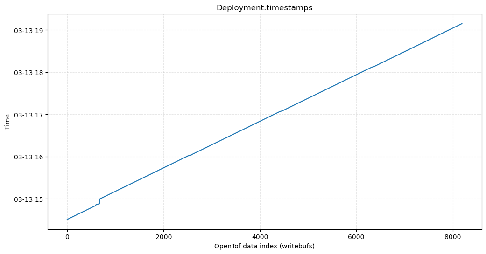

This variable is used extensively within OpenTof. We will use it later to plot the timeseries of some other important attributes/variables...

### Deployment.tofdata

The `Deployment.tofdata` array is one of the largest attributes in any Deployment object, and as such is stored as a `dask` array. The tofdata dataset is two dimensional where the first dimension is time and the second dimension is the mass spectra at that time.

```python
print(d.tofdata)
            Array	        Chunk
Bytes	    0.95 GiB	    71.19 MiB
Shape	    (8194, 31104)	(600, 31104)
Dask graph	22 chunks in 45 graph layers
Data type	float32 numpy.ndarray
```

```python
print(type(d.tofdata))
<class 'dask.array.core.Array'>
```

This one isn't so large, but they can get quite large!

This is what a single spectra looks like (the "middle-most" spectra in this case).

```python
plt.figure(figsize=(12,6))
plt.plot(d.first_guess_mass_axis, d.tofdata[int(len(d.tofdata) / 2), :])
plt.title("Middle Spectra")
plt.ylabel("ions/s")
plt.xlabel("m/z")
plt.grid(True, alpha=0.3, linestyle="--")
plt.show()
```

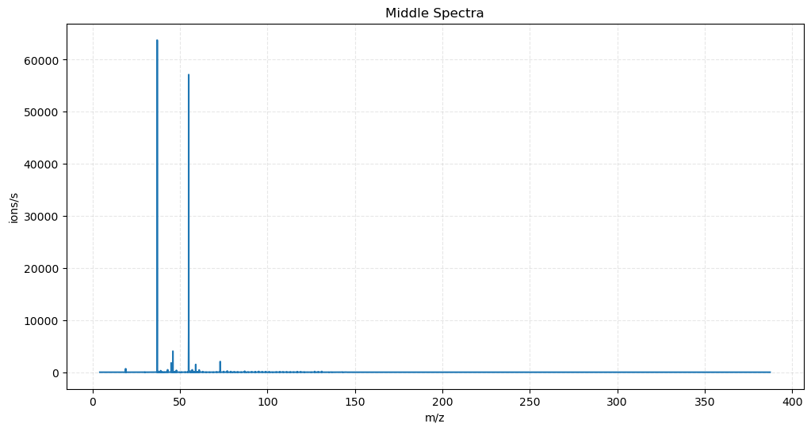

**IMPORTANT NOTE!** The first dimension of the `Deployment.tofdata` dataset (`8194` in our example) is an important quantity within OpenTof. This axis is also the same length as the 1D numpy array `Deployment.timestamps` representing the time a spectra was recorded by the instrument. However, throughout this documention when we are referring to a specific index position along this axis, this index position is often called a "writebuf" or a "MS_index" (mass spectrum index). These terms are interchangable and equivilent.

### Deployment._averaged_dataset

The `Deployment._averaged_dataset` attribute is responsible for storing an averaged version of the original `Deployment.tofdata` dataset. The averaged dataset is generated and stored automatically during procedures like `Deployment.mass_calibration`, but a new averaged dataset can be manually requested via [Deployment.generate_averaged_dataset](#Deployment.generate_averaged_dataset).

The attribute itself is a tuple with three elements:

```python
print(type(d._averaged_dataset))
# output
<class 'tuple'>
```

```python
# np.array containing the interval averaged spectra
d._averaged_dataset[0] # Example shape: (48, 31104)
# np.array containing midpoint timestamps for each averaging interval
d._averaged_dataset[1] # Example shape: (48,)
# np.array containing a mapping of each of the original writebufs (MS indecies) to their associated averaging interval
d._averaged_dataset[2] # # Example shape: (8194,)
```

Here is how you can use this attribute to plot a certain averaged spectra or to use a boolean mask to find all of the spectra within the original `Deployment.tofdata` dataset that contributed to a particular averaged spectra:

```python
interval_index = 10
plt.figure(figsize=(12,6))
plt.plot(d.first_guess_mass_axis, d._averaged_dataset[0][interval_index, :], color="royalblue")
plt.title(f"Averaged dataset at {d._averaged_dataset[1][interval_index]}")
plt.grid(True, alpha=0.3, linestyle="--")
plt.show()

# These two lines are equivlent!
target_index_mask = d._averaged_dataset[2] == interval_index
# target_index_mask = d.calibration['interval_indices'] == interval_index

# Get all of the spectra within tofdata associated with this averaging interval
filtered_spectra = d.tofdata[target_index_mask, :]
```

### Deployment.plot_dir and Deployment.default_plot_prefix

OpenTof will often produce plots with its functions to aid in visualizing the performed operation. 

where plots our outputted for a current Deployment can be specifed by passing a string path to `Deployment.plot_dir` which is `None` by default.

If Deployment.plot_dir is still `None` by the time a plot is produced, the plot will automatcially save itself under a newly created "OpenTof" folder in the user's home base directory according to the `get_default_plot_dir` function from `utils.py`.

In addition to specified a `plot_dir` the Deployment object also has an attribute: `d.default_plot_subdir` which is populated by default as a string of the first timestamp (format: "yyyymmdd_hhmmss") of the Deployment (from `d.timestamps`). This is generally used to create a sub-directory underneat the main `plot_dir` with information for a particular Deployment. 

If it is your first time running OpenTof leave these at their default values!

Some keywords to look out for when exploring the source code are:

- `show_plot_flag` : Which generally triggers `plt.show()` for the current plot
- `save_plot_flag` : Which can be set to `True` to save the figure (will save at default location unless specified)
- `output_dir` : Can be supplied manually with a String variable to override the default plot directory name (`d.plot_dir` if `None` then ot.)
- `plot_subdir` : Can be supplied mannually with a String variable to override the default plot sub-directory name (`d.default_plot_subdir`) that a plot gets saved in.

If defaults are not modified from their original values OpenTof will produce plots at the following file locations (assuming a Windows operating system):

Plots produced by OpenTof will be saved to a subdirectory within:

`C:\Users\user\OpenTof` <- this is `d.plot_dir` by default

With all plots going into a sub-directory named after the String within `Deployment.default_plot_subdir`. For our 2026.03.13 example the default path would be:

`C:\Users\user\OpenTof\20260313_143039`


## High Resolution Time Series (HRTS) Wrapper Functions

What makes up the "core" functionality of OpenTof are a series of methods contained within the Deployment class. When these functions are chained together they make up a workflow that produces a high resolution time series. Previous users of Tofware will find many similarities to the "HRTS" IGOR Procedure/Workflow. Each method will be demonstrated here with a few examples of some other options users may find helpful when trying out OpenTof on their own data.

### Deployment.mass_calibration

Since a Time-of-Flight (ToF) mass spectrometer can only measure the time it takes for an ion to travel from the pulser to the detector, the mass calibration's job is to associate an exact Time-of-Flight with an exact Mass-to-Charge. 

The mass calibration function performs this by tracking the position of a few known calibrant peaks and optimizing the parameters of a chosen mathematical model (typically a power-law or square root relationship) based on these positions and the known masses of the calibrants.

Keeping with the same data we loaded in before, we know that this data is from a PTR-ToF-MS that relies on proton transfer reactions as its ionization technique (the way it adds a charge to a compound). As such, we might guess a few calibrants could be clusters of water (because this data measures ambient air).

```python
# Define a dictionary of known calibrants we expect in background air
calibrants = {
    "H3O+": 19.0178,
    "H3O+(H2O)": 37.0284,
    "H3O+(H2O)2": 55.0390
    "H3O+(H2O)3": ot.return_mass("H3O+(H2O)3"),
}

# HINT! Here we used `ot.return_mass` to find the mass of the large water cluster
# ot.return_mass("H3O+(H2O)3") # output: 73.049535

# Run the mass calibration
d.mass_calibration(calibrants=calibrants)
# output
"""
⏳ Generating interval-averaged dataset (300 sec windows)...
Computing averaged dataset...
✅ Averaged dataset successfully stored in deployment object. (Deployment._averaged_dataset and Deployment._averaged_dataset_interval)
Using mass calibration mode 2: i(m) = p1 * m^p3 + p2
--------------------------------------------------
Using Stored Averaged Dataset.
Number of intervals with 300 sec averaging: 48
Calibrant list: ['H3O+', 'H3O+(H2O)', 'H3O+(H2O)2', 'H3O+(H2O)3']
Using search range of 31
Calibration results stored in Deployment.calibration
"""
```

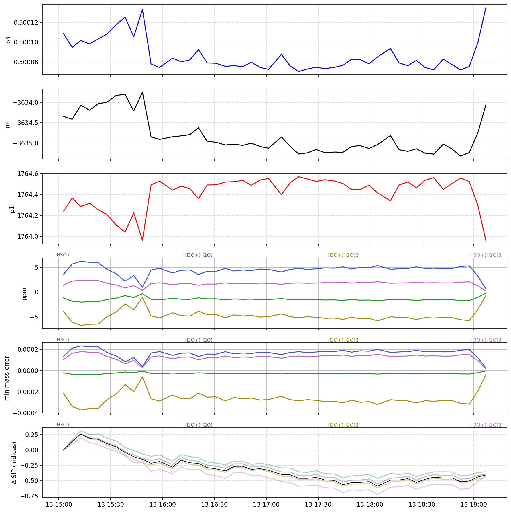

Since the fitted position for a calibrant also depends on slight fluctuations (expansions/contractions) of the TOF chamber due to varying ambient temperature, OpenTof also tracks the change in these calibration parameters over the course of the deployment.

From the code output and summary figure there are a few things to notice:

1. The mass calibration function that is optimized is the power-law relationship: `i(m) = p1 * m^p3 + p2`.
      - NOTE: This can be changed via the `mass_cal_mode` parameter (try the same code but this time adding `mass_cal_mode=0` to the function call)!
2. The results from the calibration were stored within the Deployment object under `Deployment.calibration`.
3. OpenTof performed the calibration over an averaged version of the `Deployment.tofdata` dataset and stored this dataset in `Deployment._averaged_dataset`.
      - OpenTof created 48 5-minute averages, which means our deployment spans roughly `((48 * 5) / 60) = 4 hours`
      - NOTE: `Deployment._averaged_dataset` is actually a `tuple` where `d._averaged_dataset[0]` is the averaged dataset itself and `d._averaged_dataset[1]` is the midpoint timestamp associated with each averaging interval!
4. The precise variations in our mass calibration parameters (`p1`, `p2`, `p3`) can be tracked over time, as well as the variation in the error of the mass calibration (`ppm` and `min_mass_error`) and the drift of the calibrant peaks in sample index space ($\Delta$ SIP). "SIP" = "Sample Index Position".

Before we move onto the next "core" method it is important to note another central method for mass calibrations available within OpenTof.

Let's say you know know a bunch of calibrants that _could_ make good calibrants, but you are not necessarily sure which of these calibrants yield a good calibration. One method for iterativly filtering out bad calibrants can be triggered by adding `auto_reject=True` to the `d.mass_calibration` function call.

An example of this functionality is as follows:

```python
calibrants = {
    "(H2O)2H+": ot.return_mass("(H2O)2H+"), # Water Cluster
    "CH4OH+" : ot.return_mass("CH4OH+"),
    "C2H3NH+": ot.return_mass("C2H3NH+"), # Acetonitrile
    "C2H4OH+": ot.return_mass("C2H4OH+"), # Acetaldehyde
    "NO2+" : ot.return_mass("NO2+"),
    "CH4SH+" : ot.return_mass("CH4SH+"),
    "(H2O)3H+" : ot.return_mass("(H2O)3H+"), # Water cluster
    "C3H6OH+": ot.return_mass("C3H6OH+"), # Acetone
    "C6H6O3H+" : ot.return_mass("C6H6O3H+"),
    "C3H7O2+": ot.return_mass("C3H7O2+"),
    "C2H5O2+": ot.return_mass("C2H5O2+"), # Ethyldioxy
    "C5H8H+" : ot.return_mass("C5H8H+"),
    "C6H6+" : ot.return_mass("C6H6+"), # Charge Transfer Benzene
    "C6H6H+" : ot.return_mass("C6H6H+"), # Protonated Benzene
    "C7H8H+": ot.return_mass("C7H8H+"), # Toluene
    "C5H6H+" : ot.return_mass("C5H6H+"),
    "C8H10H+" : ot.return_mass("C8H10H+"),
    "C9H12H+" : ot.return_mass("C9H12H+"), # trimethyl benzene
    "C7H7ClH+" : ot.return_mass("C7H7ClH+"), # 2,Chlorotoluene
    "C9H9NH+" : ot.return_mass("C9H9NH+"),
    "C6H18Si3O3H+" : ot.return_mass("C6H18Si3O3H+"), # D3 Siloxane
    'C8H25O4Si4+' : ot.return_mass('C8H24O4Si4H+'), # D4 Siloxane
    'C10H31O5Si5+' : ot.return_mass('C10H30O5Si5H+') # D5 Siloxane
}

d.mass_calibration(calibrants,
                   # Turn on auto rejection
                   auto_reject=True, 

                   # This is the ppm accuracy threshold 
                   #  for which to stop optimization
                   auto_reject_threshold=25.0,
                   )
# Output
"""
ℹ️ Using cached averaged dataset (300s interval).
Using mass calibration mode 2: i(m) = p1 * m^p3 + p2
--------------------------------------------------
Using Stored Averaged Dataset.
Number of intervals with 300 sec averaging: 48
Calibrant list: ['(H2O)2H+', 'CH4OH+', 'C2H3NH+', 'C2H4OH+', 'NO2+', 'CH4SH+', '(H2O)3H+', 'C3H6OH+', 'C6H6O3H+', 'C3H7O2+', 'C2H5O2+', 'C5H8H+', 'C6H6+', 'C6H6H+', 'C7H8H+', 'C5H6H+', 'C8H10H+', 'C9H12H+', 'C7H7ClH+', 'C9H9NH+', 'C6H18Si3O3H+', 'C8H25O4Si4+', 'C10H31O5Si5+']
Using search range of 31
--> Auto-rejecting 'C6H18Si3O3H+' (Error: 473.6 ppm). Retrying calibration...
--> Auto-rejecting 'C5H8H+' (Error: 354.6 ppm). Retrying calibration...
--> Auto-rejecting 'CH4SH+' (Error: 233.8 ppm). Retrying calibration...
--> Auto-rejecting 'C8H25O4Si4+' (Error: 109.4 ppm). Retrying calibration...
--> Auto-rejecting 'C8H10H+' (Error: 115.7 ppm). Retrying calibration...
--> Auto-rejecting 'CH4OH+' (Error: 103.8 ppm). Retrying calibration...
--> Auto-rejecting 'C9H12H+' (Error: 79.7 ppm). Retrying calibration...
--> Auto-rejecting 'C6H6+' (Error: 137.9 ppm). Retrying calibration...
--> Auto-rejecting 'C2H3NH+' (Error: 101.7 ppm). Retrying calibration...
--> Auto-rejecting 'C6H6H+' (Error: 79.0 ppm). Retrying calibration...
--> Auto-rejecting 'C7H7ClH+' (Error: 69.1 ppm). Retrying calibration...
--> Auto-rejecting 'C9H9NH+' (Error: 43.9 ppm). Retrying calibration...
--> Auto-rejecting 'C7H8H+' (Error: 29.7 ppm). Retrying calibration...
--> All remaining calibrants meet auto-reject criteria. Optimization complete!
"""
```

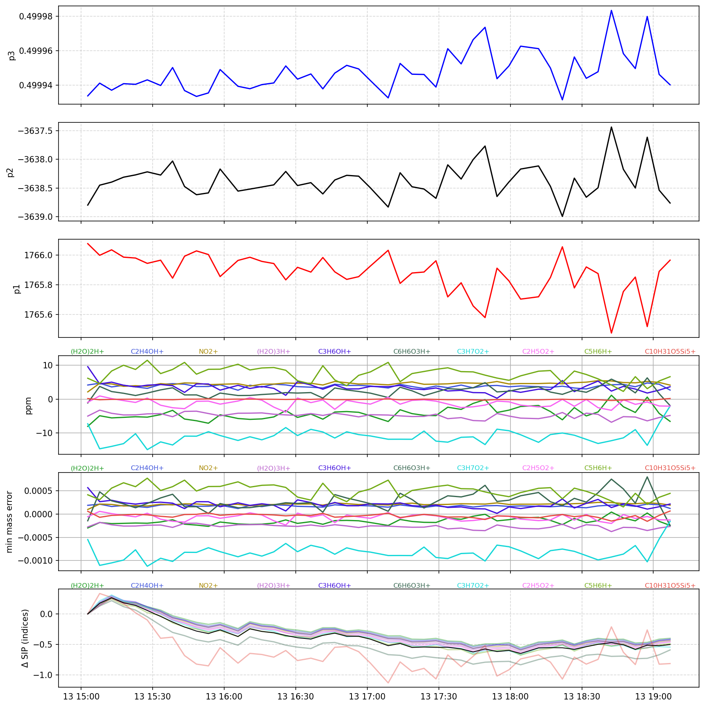

Which revealed to us which calibrants were deemed the most stable according to the auto rejection algorithm.

_(For a deeper dive into mass calibration modes, specialized mass calibrations, and additional diagnostic plots see our detailed [mass_calibration_guide](../user-guide/mass-calibration.md))_

### Deployment.determine_reference_spectrum

The next "core" method to discuss is a function to determine the reference spectrum.

If using all default settings this function first evaluates what mass-to-charge is the strongest within the spectrum itself, slices a region of signal from `Deployment.tofdata` around the found most intense peak, and then fits a peak at that location across all writebufs. The timeseries of this peak postion offset is then evaluated by a combined score considering both the rolling standard deviation of the peak position offset, and how close the offset is to `0` ppm. OpenTof will use these two combined metrics to find the best window of signal for which to average between, thus defining the reference spectrum.

Determining a reference spectrum is necessary as a representative spectrum is needed for a few other "core" OpenTof methods, mainly determining both the peak width function and the instrument specific peak shape (link each section here) which will be discussed later. But it is important to note here that the period used to define the reference spectrum both minimizes broading effects due to a drifting mass calibration, and averages enough spectra to get an adequate signal-to-noise ratio.

In OpenTof, one way to determine the reference spectrum is to call (using all default inputs):

```python
# Still using our example PTR data
d.determine_reference_spectrum()
# Output
"""
Automatically determining reference peak mass using the location
of max intensity within the sampled average spectra...
Reference peak determined to be at m/z: 37.02...
Defining reference spectrum across 48 calibration intervals and 7129 writebufs.
Loading reference peak signal region [7012:7198] across all writebufs into RAM...
Fitting reference peak: ################## 100% 7129/7129 [00:26<00:00, 345.41it/s]
Interpolating reference peak position between fitted spectra (fit_every_n=3)...
Reference peak positional offset determined! Selecting best [600] second window...

Defining reference spectrum between timestamps:
2026-03-13 18:51:44.859998 -> 2026-03-13 19:01:44.859998
Metrics for best window:
  - std: 5.0360
  - zero: 22.6699
  - combined_score: 0.0078
Number of MS inside window: 300

Reference Spectrum shape: (31104,)
Unique mass calibrations intervals spanning reference spectrum window: [44 45 46] 

Average mass calibration parameters across reference spectrum window are:
p1: 1765.753404
p2: -3638.216309
p3: 0.499958
"""
```

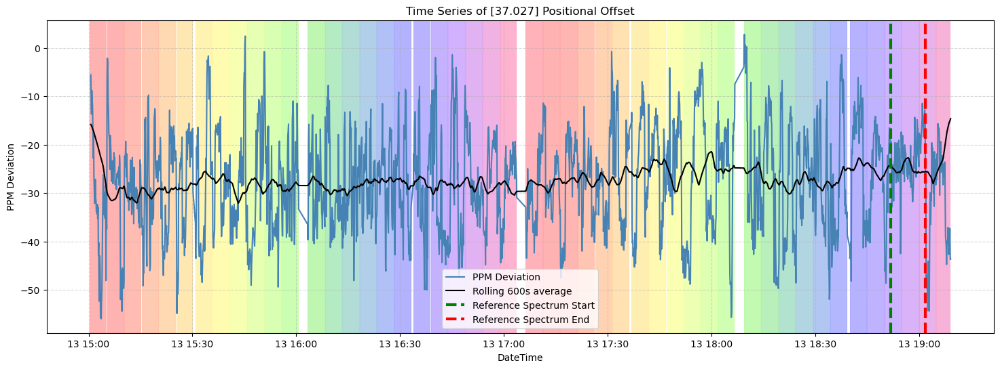

Here we see OpenTof has chosen a region of signal near the end of the time series. From the code output we can also see that the default window size is 10 minutes (or 600 seconds). 

A visualization of the reference spectrum is also rendered by default.

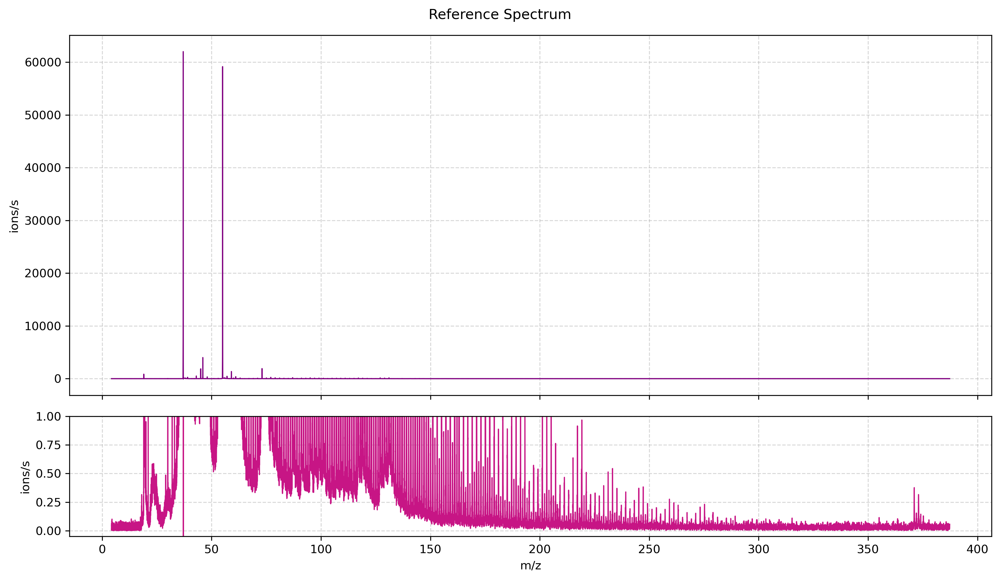

However, some users may wish to specify the mass to be tracked when defining the reference spectrum, or use a smaller or larger window size. Both of these can be controlled within OpenTof via the `reference_peak_mass` and `window_seconds` keywords respectively.

As such, a more specific call to the determine_reference_spectrum function might look like this:

```python
d.determine_reference_spectrum(reference_peak_mass=ot.return_mass("C3H6OH+"),
                               window_seconds=300,

                               ## Other keywords for additional control
                               # The weights to use when evaluating a window
                               methods_weights_dict={'std': 0.4, 'zero': 0.6}, 
                               # Fit everything and don't interpolate
                               fit_every_n=1, 
                               # y-axis max for the zoomed secondary reference spectrum plot 
                               plt_y_max=10 
                               )
# Output
"""
Defining reference spectrum across 48 calibration intervals and 7129 writebufs.
Loading reference peak signal region [9835:10021] across all writebufs into RAM...
Fitting reference peak: 100%
 7129/7129 ################## [00:25<00:00, 249.38it/s]
Reference peak positional offset determined! Selecting best [300] second window...

Defining reference spectrum between timestamps:
2026-03-13 15:38:35.877895600 -> 2026-03-13 15:43:35.877895600
Metrics for best window:
  - std: 4.8562
  - zero: 0.0044
  - combined_score: 0.0006
Number of MS inside window: 149

Reference Spectrum shape: (31104,)
Unique mass calibrations intervals spanning reference spectrum window: [7 8] 

Average mass calibration parameters across reference spectrum window are:
p1: 1765.918329
p2: -3638.250407
p3: 0.499943
"""
```

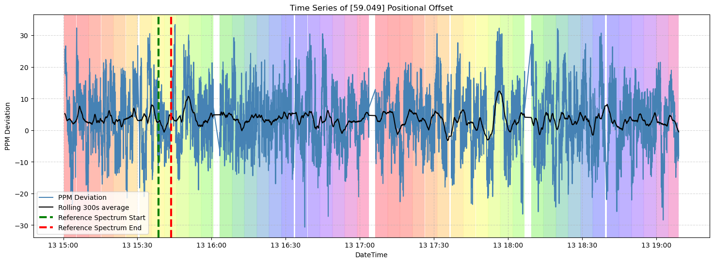


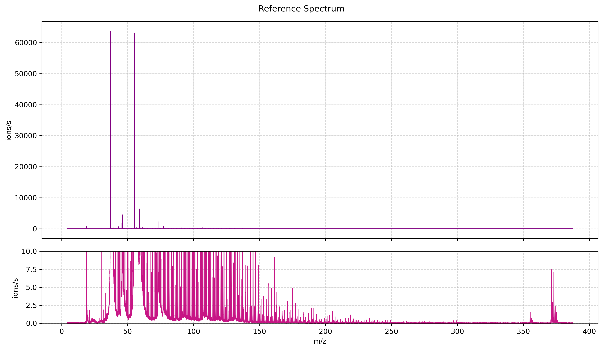

Here we can see that a different window was chosen to define the reference spectrum.

The slightly more specific function call above also highlights a few other important keywords within the `d.determine_reference_spectrum` function call: 

- `reference_peak_mass`: The mass to be tracked for determining the ppm offset timeseries.
- `window_seconds`: The window size (in seconds) to evaluate over.
- `methods_weights_dict`: A Python dictionary with the weights to give to both standard deviation and ppm devation close to zero to be evaluated over the specified `window_seconds`.
- `fit_every_n`: To speed up the procedure a bit, OpenTof will, by default, only fit every 3rd spectra and linearlly interpolate between ppm deviations as a result of this fitting. However, if this is not desired or is causing instability when defining the reference specrum this parameter can be set to `1` to fit every spectrum and override the default interpolation. Try adjusting this value and to see how the function responds!
- `plt_y_max`: is a plotting keyword that simply sets the max y-scale for the lower zoomed-in pane in reference spectrum plot.

It is also possible to manually select a reference spectrum window, in which case the reference spectrum will be every spectrum between the specified starting and ending time:

- `cursor_starttime`: The starting time that is used when defining the reference spectrum. Must be a either a Pandas Timestamp or np.datetime64.
- `cursor_endtime`: The ending time that is used when defining the reference spectrum. Must be a either a Pandas Timestamp or np.datetime64.

_(More information regarding minor keywords and/or other speed tradeoffs when defining the reference spectrum are detailed in OpenTof's [mass_calibration_guide](../user-guide/mass-calibration.md))_

### Deployment.determine_baseline

This function defines what is considered the mass spectrum "baseline" for a given Deployment. The purpose of defining a baseline is to (ideally) fully subtract out the area below where a peaks "starts" in the mass spectrum (scribbled red area in the plot below). The function itself is based on the method described in: Timonen et al., Atmos. Meas. Tech., 2016. The `intensity_spectrum` for which the baseline definition function is called upon can be specified, but by default it uses the reference spectrum, which is stored in `Deployment.reference['reference_spectrum']`.

The determine baseline function can be called with:

```python
d.determine_baseline(plt_y_max=25) # plt_y_max is just an optional plot/visual keyword
# Output for example day
"""
Window size is: 31
Centering visualization around sample index: 10368
Using a +-sample index window of: 1000
"""
```
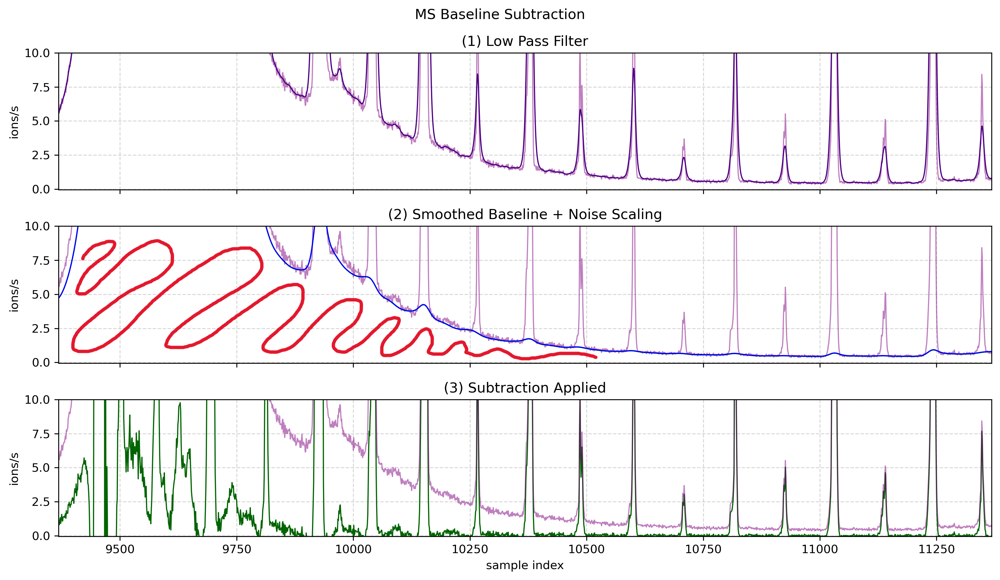

This methods works in a few steps.

1. A low pass filter is applied to the spectrum, controlled by the keywords: `cutoff_freq` and `fs` which represent the cut-off frequency and sampling frequency in nanoseconds.
2. A running box (minimum) filter is applied to the low pass data that selects the lowest intensity value within a certain `window_size`.
3. This same `window_size` is also used to apply a scipy.gaussian_filter1d to heavily smooth the baseline.
4. A "noise level" is then determined for the spectrum and a flat upward correction is applied to move the baseline to the center of the noise. This "noise level" is based on the `noise_percentile` parameter (default `10`) which takes the `noise_percentile` percentile of a rolling standard deviation of the `intensity_spectrum` also using the `window_size`.

Due to its use within the `determine_baseline` function the `window_size` is by far the most important parameter. If not provided OpenTof will guess a window size of 1/1000th of the `len()` (length) of the 1d `intensity_spectrum` provided, but it is important to make sure this value is appropriate.

The largest errors in this procedure occur around strong peaks in the mass spectrum (as shown near sample index 9500 in the figure above), but it works resonably well unless intensity errors on the order of <1% are needed. In which case a custom method for determining the baseline will needed, as this is the only baseline determination function currently within OpenTof... (If you write one be sure to submit a pull request!)

### Deployment.determine_peak_width

The goal of the `determine_peak_width` function is to define how the FWHM changes as a function of mass to charge. This function can be described as a linear function in mass-to-charge space and as a non-linear function in resolving power space.

Ideally, the peak width function represents the change in FWHM of isolated ions within the mass spectrum, as theoretically a peak width cannot be less than that of an iosolated ion peak. Peaks that have potential interverences and/or contain overlapping peaks are ideally excluded from this calculation, as they would inflate the FWHM due to the signal potentially appearing as broader due to these interferences.

The `determine_peak_width` function can be called using default values with:

```python
d.determine_peak_width()
# Output
"""
Determining peak width using RANSAC regression...
Fit FWHM linear model (mass space): y = 0.00041 * x + 0.00684
Minimum FWHM model: y = 0.00041 * x + 0.0001
RANSAC identified 41 inliers and 66 outliers.
"""
```
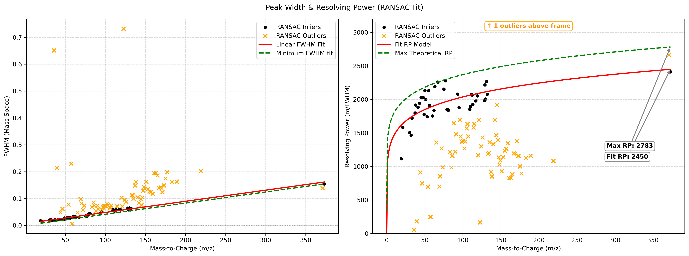

This function utilizes [scikit-learn's RANSAC Regressor](https://scikit-learn.org/stable/modules/linear_model.html#ransac-regression) by default to determine the peaks to use when fitting a linear regression model on the found FWHM values. A more comprehensive overview of this method and its purpose when defining the peak with function can be found within [peak_width_shape.md](../user-guide/peak_width_shape.md).

The `determine_peak_width` function generally follows these steps:

1. Peaks are first found within the spectrum via a `min_prominence` (default=`0.9`) which uses `scipy.signal.find_peaks` and a peak fit is performed at each of the found peak positions to retrieve its FWHM. 
2. Peaks are filtered by mass spacing, enforcing that peaks can be no closer than `minimum_mass_spacing` (default `1`m/z) away from one another. This filtering further attempts to exclude non-isoloated peaks.
3. A RANdom SAmple Consensus procedure is called using a linear regression model to determing inlires/outlires of the found FWHM values within the spectrum. The tolerance for this inlire-outlire classification is controlled by the `residual_threshold_multiplier` parameter (default `0.10` representing a residual threshold of 10% of the median FWHM) which can be increased or decreased on an instrument by instrument basis. Try values of `0.50` and `0.05` to see how the function reponds!
4. A linear model is then fit to the inlire data to determine the 'best-fit line' when defining the FWHM function. This is red line in the plot. Additionally, a power model following the form `a * (mass ** b)` is also fit in resolving-power space.
5. The **minimum** theoretical peak width (and conversely highest theoretical resolving power) is also be found via a final flat correction downward to the best-fit line based on the inlire point that is furthest away from (but ultimately lower) that the best-fit line itself. A visualization of this process results in the dashed green line in the plot above (applied in both mass-to-charge and resolving power space).

The peak width function can be retrieved from the Deployment object via:

```python
d.peak_width_function(78) # peak width at m/z 78 
0.03915650883803775
```

`Deployment.peak_width_function` be default returns the fit peak width function represented by the red line in the plot above. However, the `min_peak_width_function` (represented by the green dashed line) can be retrieved via:

```python
d.min_peak_width_function(78)
# slightly lower than fit peak width value above
0.03241360844186477
```

Because the FWHM of isolated peaks are calculated when defining the peak width function, this procedure can also yeild a good approximation of the resolution/resolving power (and max resolving power) of the instrument, as shown by the annotations in the right pane of the above plot.
 
In principle any spectrum can be used to define the peak width function by inputting a custom spectra as the `reference_spectrum` but this procedure should generally be called using the current reference spectrum (which is the default value) as if the reference spectrum is also defined prior to calling this function using the method described above, it should contain minimal broading due to a drifting mass calibration. If using a custom spectra be sure that the spectra contains minimal mass calibration broadening and is sufficiently averaged to provide an adaquate signal-to-noise ratio.

If necessary the value of the resolving power function at a certain mass-to-charge can also be retrieved with:

```python
d.resolving_power_function(78)
1950.700737155831
```

More information regarding the process of defining the peak width function and alternative methods for determing the peak width can be found within [peak-width-shape.md](../user-guide/peak-width-shape.md).

### Deployment.determine_peak_shape

Although we would love for peaks in the mass spectrum to follow a perfect gaussian shape, this is rarely the case, and as such, defining a custom instrument-specific peak shape can be benifitial for both refining the mass calibration and for more accurate integration of final peak areas.

To define an instrument specific peak shape using all default parameters it is only necessary to call:

```python
d.determine_peak_shape()
# output
"""
Left halves retained: 13 / 92
Right halves retained: 23 / 92
Saving Peak Shape to: C:\Users\User\OpenTof\20260313_143039\custom_shape.npz
"""
```
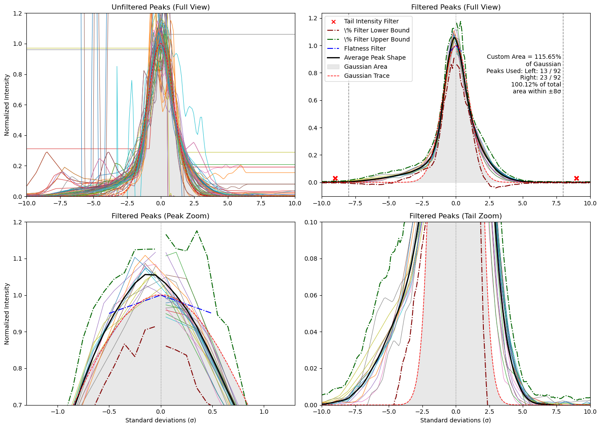

This function also makes use of Scipy's `signal.find_peaks` function but it does so iteratively stepping down an intensity threshold to find at least `num_peak_threshold` peaks (default=`70`) but often times a few more. A `step` size can be manually specified but will decrease by `1` to a minimum of `1` after a peak is found. This just helps it run a bit quicker as a it can take a wile with a smaller step size to iteratively step down from the reagent ion peaks. Additionally, it also helps prevent the iteration from jumping into the noise region of the spectra which can happen with a large step size (in which case multiple hundreds of peaks will be found).

Just like the `determine_peak_width` function the reference spectrum is used by default, although it is possible to use any spectrum for this purpose by provided a properly aligned 1D intensity array as the `reference_spectrum`.

After enough peaks have been found a gaussian is fitted at the positions of the found peaks and that fitted shape is then normalized to a standard domain of ±20 std. The resulting shapes are then optionally smoothed via the `peak_smoothing` parameter which is `0` by default (no peak smoothing is performed) but a value greater than 0 can be provided if smoothing is desired.

The remainder of the function is a set of filters that progressively aim to exclude found peaks/peak shapes from impacting the average shape too greatly. There are three primary filters that attempt to automatically filter out outlier peak shapes. 

1. **Tail Intensity Filter**: This is a basic filter that looks at the normalized intensity value near the tails of the found peak shapes. By default it looks for shapes that are above `tail_intensity_cutoff` intensity (default=`0.03`) at both positive and negative `tail_sigma_pos` standard deviations (default=`9`). This will exclude shapes that are obviously too high and/or perfectly flat tails that can occur when one side of a found shape dips into the negative due to imperfect baseline subtraction (this is generally not a big deal if this happens as they will get filtered out regularly). In the plot above the "Tail Intensity Filter" is visually represented by the red "X"'s in near the tail regions of the "full view" pane.
2. **Interquartile Range (IQR) and "Omega" filters**: The IQR and Omega filters acts independently on both the right and left sides of the found peak shapes. To implement this filter OpenTof will first calculate the IQR (75th percentile - 25th percentile) shape along the found peak shapes for each side independently. It will then calculate a maximum allowable lower bound and upper bound based on `iqr_thresh_left`, `iqr_thresh_right`, `omega_l`, and `omega_r`. Both `iqr_thresh_left` and `iqr_thresh_right` are a flat multiplier (default=`2.5`) that gets applied to either side of the of the IQR to push upward/downward the minimum and maximum filter bounds. This can be set to a lower value (try `1.5` or `1`) for more aggresive filtering. Both `omega_l` and `omega_r` (value between 0 and 1, `omega_r` default=`0.7`, `omega_l` default=`0.8`) act as a scaling parameter that is also considered when the defining upper/lower bounds by tightening how aggressive the filter is near the peak apex. This is necessary because there is often higher variability in both max amplitude and horizontal postion of found peak shapes nearer to the shape apex, and relying on just the IQR filter for this is often not enough. Both `omega` parameters can be set to `0` to turn off the omega filtering or set to `1` for maximum filtering (you should try this at least once to see how the filtering responds!) but usually `0` is too conservative and `1` is much to aggresive, so some degree of `omega` filtering has so far produced reliable results. In the instruments OpenTof has so far been tested with, peaks generally lean a little to the left so the `omega_r` parameter has slightly stricter bounds as right side peak shapes are generally more clean than their left sided counter parts. Conveinently, the exact bounds of the IQR and Omega filtering are also visualized in the plot above as "dash-dotted" green (filter upper bound) and red (filter lower bound) lines.
3. **"Flattness" Filter**: The flattness filter is the last layer of filters that is currently considered when defining the peak shape, it generally excludes only a few peaks if any. The "flattness" filter acts within a narrow `flattness_region` (default=`0.5`) sigma distance around both sides of `0` standard deviations and aims to exclude peak shapes that are too "flat" near their apex. It will look at a peak shape's minimum and maximum value at both sides of the `flattness_region` (independently) and if the ratio of its minimum value is above `flattness_thresh` (value between 0 and 1, default=`0.95`) of its maximum value the peak is rejected. By default this is set to a very lenient `0.95` meaning that only almost perfectly flat peaks will be rejected. For the flattness filter higher means more tolerant to flattness. The Flattness Filter is visualized in the "Peak Zoom" (lower left quandrant) of the plot above showing the slope of maximum allowable "flattness" within the `flatness_region`. If this is your first time running OpenTof it is advisable to try setting the `flattness_thresh` to a lower value to see how the function responds. The `flattness_region` can also be extended to cover more or less standard deviation space, but generaly a value between `0.5` and `1` has proven to yeild good results.

Whew!

Within the parameters of the `determine_peak_shape` function the `cursor_position` (default=`8`) can also be modified to adjust the ± standard deviation bounds that the statistics in the "Full View" (upper right side pane) of the plot above are calculated between.

The result of the `determine_peak_shape` function is the callable function:

```python
d.custom_peak_shape
# <function opentof.peak_width_shape.peak_shape.<locals>.custom_shape(x, A, x_c, FWHM)>
```

Which can be called indpendently for whatever purpose or be specified when calling `d.mass_calibraion` or fitting/integation functions. 

For a more comprehensive explanation of all paramters available when defining the peak shape see [peak-width-shape.md](../user-guide/peak-width-shape.md).

### Deployment.populate_peak_list_and_isotopes

This is a small function with the simple task of populating `Deployment.peak_list` and `Deployment.isotopes`

It can be called by passing a list of string chemical formulas like so:

```python
peak_list = [
            "C2H4OH+", # acetaldehyde
             "C4H6H+", # 1-3 butadiene
             "CH4SH+", # methanethiol
             "C2H3NH+", # acetonitrile
             "C3H6OH+", # acetone
             "C3H6O(H2O)H+", # acetone water cluster
             "C4H8OH+", # MEK
             "C6H12H+", # hexene
             "C6H6+", # CT benzene
             "C6H7+", # protonated benzene
             "C7H8H+", # toluene
             "C2Cl4H+", # tetrachloroethylene,
             "C8H10H+", # xylene
             "C9H12H+", # TMB
            ]

d.populate_peak_list_and_isotopes(peak_list)

# Print out peak list information (python dictionary)
d.peak_list
# output
"""
Num peaks: 14

{'peaks': ['C2H4OH+',
  'C4H6H+',
  'CH4SH+',
  'C2H3NH+',
  'C3H6OH+',
  'C3H6O(H2O)H+',
  'C4H8OH+',
  'C6H12H+',
  'C6H6+',
  'C6H7+',
  'C7H8H+',
  'C2Cl4H+',
  'C8H10H+',
  'C9H12H+'],
 'centers': array([ 45.033491,  55.054226,  49.010647,  42.033825,  59.049141,
         77.059705,  73.064791,  85.101176,  78.046401,  79.054226,
         93.069876, 164.882687, 107.085526, 121.101176]),
 'fwhms': array([0.02426617, 0.02906685, 0.02617153, 0.02282911, 0.03098072,
        0.03960912, 0.03769526, 0.04346159, 0.04008182, 0.04056465,
        0.04727919, 0.08168289, 0.05399374, 0.06070828])}
"""

d.isotopes
"""
{'C2H4OH+': [(45.033491200840935, 1.0),
  (46.03684603594093, 0.021631456585464462),
  (47.03773619414093, 0.002054993634531912)],
 'C4H6H+': [(55.054226645700936, 1.0),
  (56.057581480800934, 0.043262913170928924)],
 'CH4SH+': [(49.01064775564093, 1.0),
  (50.01003549104094, 0.007895567954521529),
  (50.01400259074094, 0.01081572829273223),
  (51.00644358524093, 0.04474155174228867)],
 ...
 'C8H10H+': [(107.08552677462094, 1.0),
  (108.08888160972094, 0.08652582634185785),
  (108.09180352051094, 0.0012651454917315488),
  (109.09223644482094, 0.0032754393980618367)],
 'C9H12H+': [(121.10117683908094, 1.0),
  (122.10453167418093, 0.09734155463459007),
  (122.10745358497094, 0.0014951719447736484),
  (123.10788650928093, 0.004211279226079504)]}
"""
```

Within `Deployment.peak_list` the peak "centers" are populated by `ot.return_mass` and "fwhm"s are automatically populated by `d.peak_width_function`. 

### Deployment.FFI_constrained

This is the first of two "Full Fitting and Integration" (FFI) functions available as a high-level wrapper function. The purpose of this function is to fit/integrate the peak areas within `Deployment.tofdata_subtracted` (note: baseline subtraction is performed) in order to populate `Deployment.peak_data` with the ions/s timeseries data across each writebuf index and every peak within `Deployment.peak_list`. Isotope signals are subtracted out at the time of fit (through a recreated signal axis) and are reallocated to the parent ion peak.

Because fits are fully constrained, only the amplitude of a selected peak within the peak list is allowed to vary in this function. Fits are optimized via a Non-Negative Least Squares procedure (`SciPy.optimize` `nnls`) first constructing a basis matrix and optimizing the amplitudes of this basis matrix to best fit a chunk of mass spectra at multiple times simultaniously.

The FFI_constrained function can be called directly on the Deployment object with the custom peak shape defined above like so:

```python
# Specify that we want to use our 'custom' peak shape!
d.FFI_constrained(peak_type='custom')
# Output
"""
[########################################] | 100% Completed | 9.06 s
"""
```

The output of this function populates `Deployment.peak_data` with type `pandas.DataFrame`. This dataframe has a "wide" format where each peak within `Deployment.peak_list` will have both an associated `"{peak_name}_amplitude"` and `"{peak_name}_area"` column where `{peak_name}` is replaced with something like `"C6H6+"`.

We can make a pretty plot of the fit results using code similar to the plotting code below!

```python
# Create vertically stacked subplots (one row per peak)
fig, axes = plt.subplots(
    nrows=len(peak_list), 
    ncols=1, 
    figsize=(12, 2 * len(peak_list)), 
    sharex=True
)

# Handle the edge case where peak_list only has 1 item (axes won't be an array)
if len(peak_list) == 1:
    axes = [axes]

cmap = plt.cm.brg
# cmap = plt.cm.hsv # could also be something like this!

# Generate color array across the colormap
colors = cmap(np.linspace(0.0, 0.9, len(peak_list)))

# Plot each peak on its own subplot
for ax, peak, color in zip(axes, peak_list, colors):
    ppb_conc = d.peak_data[f'{peak}_area']
    
    ax.plot(
        d.timestamps[d.standard_acquisition_data], 
        ppb_conc[d.standard_acquisition_data], 
        label=peak, 
        alpha=0.9,
        color=color
    )
    
    ax.set_ylabel(f"{peak}\n(ions/s)", color=color, fontweight='bold')
    ax.grid(True, alpha=0.3)
    ax.legend(loc="upper right")

# Set the overall title and bottom x-axis label
fig.suptitle("Timeseries by Species", fontsize=14, y=0.99)
axes[-1].set_xlabel("UTC time")

plt.tight_layout()
plt.show()
plt.close()
```
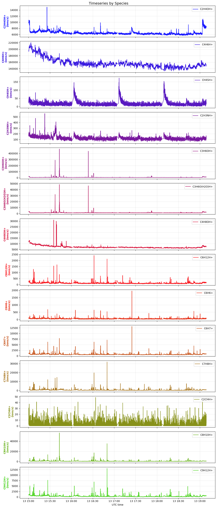

More information about the low-level constrained function that this function acts as a wrapper for can be found within [peak-fitting.md](../user-guide/peak-fitting.md).

### Deployment.FFI_unconstrained 

The second full fitting and integration function available within OpenTof is an "unconstrained" fitting and integration function. In the "constrained" version of this function only the peak amplitude is allowed to vary/be optimized, with the peak center, peak width, and peak shape all being defined by earlier procedures. However, within this "unconstrained" fitter, during the nonlinear curve fitting (scipy.optimize.least_squares - Trust Region Reflective), all of these peak parameters are allowed to vary... adding significantly more to the unconstrained fitter's computational complexity accross the entire Deployment timeseries.

This unfortunately makes the OpenTof "unconstrained" fitter significantly slower than its "constrained" fitter, so it is recommended to use the constrained fitter above if this is your first few times running OpenTof.

The unconstrained fitter can be called in a similar fashion to the constrained fitter:

```python
# Specify that we want to use our 'custom' peak shape!
d.FFI_unconstrained(peak_type='custom', verbose=True)
# output
"""
Using baseline noise level threshold: 0.0131
Parallelizing unconstrained fit over 14 peaks across 8194 spectra via Dask...
[########################################] | 100% Completed | 397.81 s
"""
```

As you can see, the unconstrained fitter takes significantly longer, however the unconstrained fitting and integration is now complete! If you see a way to speed up the unconstrained fitter be sure to submit a pull request, see [contributing.md](../contributing.md) for more details.

The contents of `d.peak_data` will be slightly different depending on whether the unconstrained or constrained fitter was used to fit the Deployment. Whereas the constrained fitter returns a dataframe where each peak in the active peak list has only an `_amplitude` and  `_area` column, in the unconstrained fitter there are the additional columns of `_center_mass` and `_fwhm_mass` which are the fitted peak center and FWHM in mass space.

We can use the same plotting code from the `FFI_constrained` block to plot the results of the unconstrained fit as well.

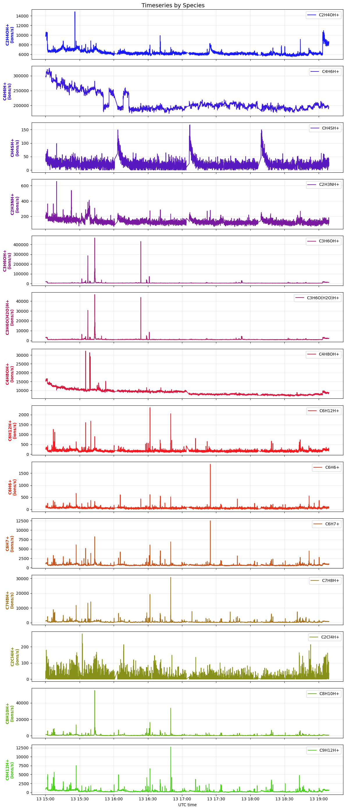


## Other `Deployment` helper functions

This subsection will discuss methods that are present within the Deployment class, but not necessarily within the "core" HRTS workflow. These methods are largely here for convienence and it is not expected that the typical user will use any or all of them in a particular workflow. However, these functions often handle tasks that the OpenTof developers had run into frequently and were therefore deemed worthy of including within the code.

### Deployment.generate_averaged_dataset

This method acts as a wrapper function around the the `generate_averaged_dataset` function within [mass_calibration.py](../user-guide/mass-calibration.md). This method will process the `averaging_interval` (default=`300`seconds or 5 minutes) parameter and will calculate the averaged dataset based on this interval and the `Deployment.timestamps` attribute.

The wrapper function can be called using:

```python
d.generate_averaged_dataset(averaging_interval=300)
print(d._averaged_dataset[0].shape)
# output
"""
ℹ️ Using cached averaged dataset (300s interval).
(48, 31104)
"""
```

In the above example the code finished immidiately because this funciton will, by default, not recalculate the averaged dataset should the requested `averaging_interval` match the averaging interval of the already calculated `Deployment._averaged_dataset`. We can override this by either specifying `recalculate=True` or by providing a different `averaging_interval`.

```python
d.generate_averaged_dataset(averaging_interval=120)
print(d._averaged_dataset[0].shape)
# output
"""
⚠️ New averaging_interval requested. Existing averaged dataset is 300s, but you requested 120s. Forcing recomputation...
⏳ Generating interval-averaged dataset (120 sec windows)...
Computing averaged dataset...
✅ Averaged dataset successfully stored in deployment object. (Deployment._averaged_dataset and Deployment._averaged_dataset_interval)
(120, 31104)
"""
```

This function will modify both `Deployment._averaged_dataset` and `Deployment._averaged_dataset_interval` in addition to modifying `Deployment.calibraition['interval_indices']` and ``Deployment.calibraition['midpoint_timestamps']``.

See the section on the attribute [Deployment._averaged_dataset](#Deployment._averaged_dataset) for more information.

### Deployment.plot_peak_data_for

This method can be called upon to quickly make a time-series plot of a particular peak parameter within `Deployment.peak_data`.

For example, to retrieve the integrated peak area for charge transfer benzene one can call:

```python
d.plot_peak_data_for("C6H6+")
# output
"""
Filtering Time Series using deployment.standard_acquisition_data
"""
```

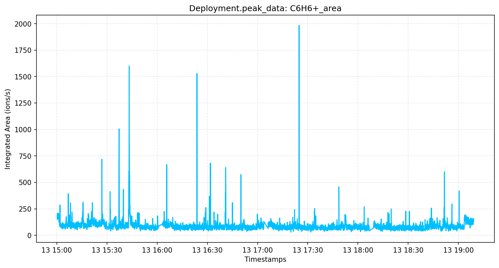

Similarly, a different parameter's time-series can be plotted by specifying the plot `parameter` which should be one of `"amplitude"`, `"fwhm"`, `"center"`, or `"area"` if a string does not match one of these exactly the plot will default to an "area" plot.

Note: `paremeter="center"` and `parameter="fwhm"` will throw a `KeyError` if called upon a Deployment.peak_data dataset that was populated with only the `FFI_constrained` function, as these columns are only generated during `FFI_unconstrained`.

By default, this plot will also automatically filter out portions of non-standard acquisition data (via `Deployment.standard_aquisition_data`) but this can be manually overwritten via setting `use_std_acq_data=False`. An example call with expanded inputs is included as an example below.

```python
d.plot_peak_data_for("C6H6+", parameter='amplitude', 
                     color="maroon", use_std_acq_data=False)
```

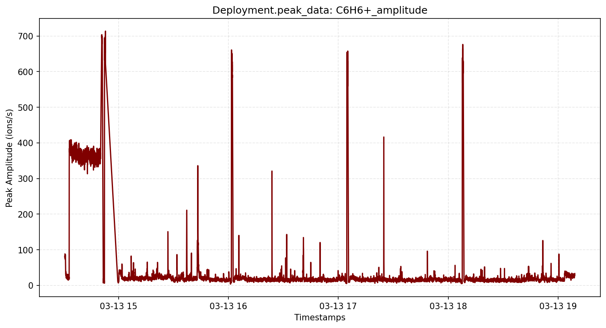

### Deployment.fit_nm_constrained

This function can be used to run the "constrained" fitting procedure on a segment of signal. It will also plot any isotoptic influences based on the current `Deployment.peak_list` if available.

Calling this function will populate `Deployment.diagnostic_fits` which 

In our example peak list we have both `C3H6O(H2O)H+`, which is an acetone water cluster, and `C6H6+` which is charge transfer benzene. The acetone water cluster happens to produce an isotope at the same mass-to-charge as charge transfer benzene (at `m/z=78`).

You can also see the overlapping isotope be inspecting the dictionary within `Deployment.isotopes` after running `d.populate_peak_list_and_isotopes(peak_list)`.

```python
d.isotopes
# output 
"""
{
...
 'C3H6O(H2O)H+': [(77.05970594936093, 1.0),
  (78.06306078446093, 0.032447184878196686), # <-- this isotope!
  (78.06598269525092, 0.0010351190386894491),
  (79.06395094266094, 0.004109987269063823)],
 'C4H8OH+': [(73.06479132976094, 1.0),
  (74.06814616486093, 0.04326291317092893),
  (74.07106807565094, 0.0010351190386894491),
  (75.06903632306094, 0.002054993634531912)],
 'C6H12H+': [(85.10117683908094, 1.0),
  (86.10453167418093, 0.06489436975639337),
  (86.10745358497094, 0.0014951719447736486),
  (87.10788650928093, 0.0017546996775331266)],
 'C6H6+': [(78.04640161347093, 1.0),
  (79.04975644857093, 0.06489436975639337),
  (80.05311128367093, 0.0017546996775331266)],
...
}
"""
```

However, to see the effect of this isotope on a peak ran at nominal mass 78 we can run an example like: 

```python
d.fit_nm_constrained(nominal_mass=77, peak_type='custom')
d.fit_nm_constrained(nominal_mass=78, peak_type='custom')
```

First we can plot at nominal mass 77 to see the parent peak:
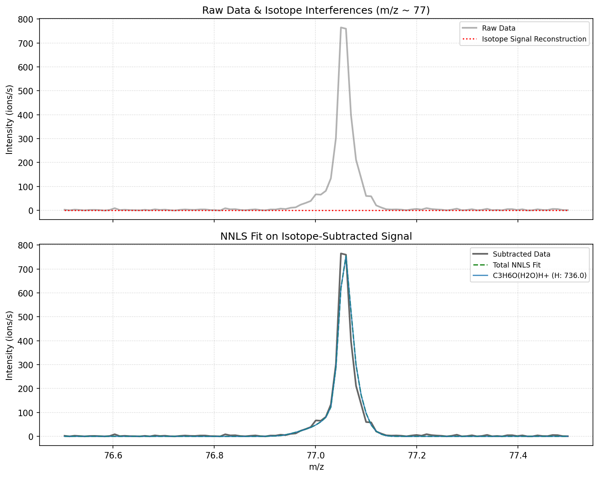

Then we can create a plot at 78 to see the effect of the isotope on the specific signal segment:

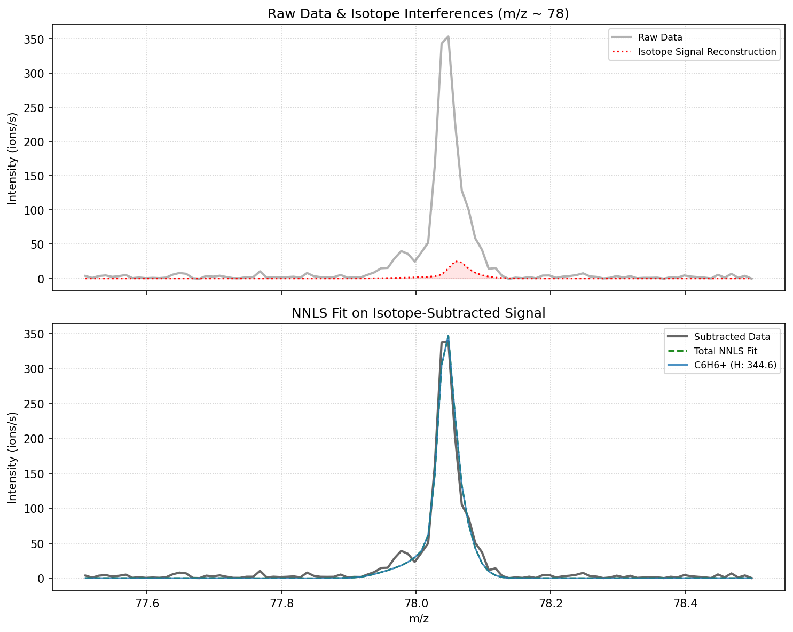

We can also call this on a specific mass spectrum index for example index `2555` which for this Deployment Object represents a period where the calibration gas is actively flowing into the instrument during a sensitivity calibration.

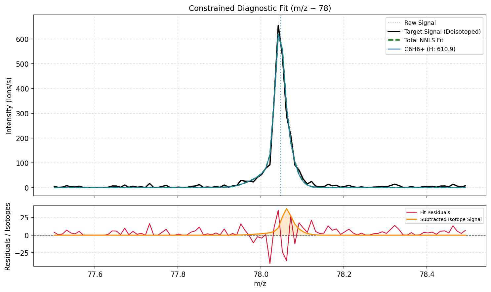

The results from running this function can be retrieved through the `Deployment.diagnostic_fits` attribute. This is a nested dictionary whose contents depends on previous calls to both `fit_nm_constrained` and `fit_nm_unconstrained`. For our nominal mass `77` and `78` example this dictionary has two entry:

```python
print(d.diagnostic_fits.keys()) # Two entries
print(d.diagnostic_fits['constrained_78'].keys()) # Information for each entry
# output
"""
dict_keys(['constrained_77', 'constrained_78'])
dict_keys(['nominal_mass', 'mz_segment', 'int_segment', 'total_fit', 'peaks', 'fit_params'])
"""
```

NOTE: This function is generally acts as a way to diagnose fits on certain spectra and should generally not be used as a bulk fitting function. Please see `FFI_constrained` for a function with better scalability.

For more about isotopes within OpenTof see [isotopes.md](../user-guide/isotopes.md).

### Deployment.fit_nm_unconstrained

This function can be used to call the `fit_unconstrained_peaks` function (the 'low-level' method behind `FFI_unconstrained`) on an isolated spectra segment. 
It can be useful when fine-tuning fitting parameters before running the full `FFI_unconstrained` function

The most basic to this function is as follows:

```python
result = d.fit_nm_unconstrained(nominal_mass=121)
```

Which produces the following plot:

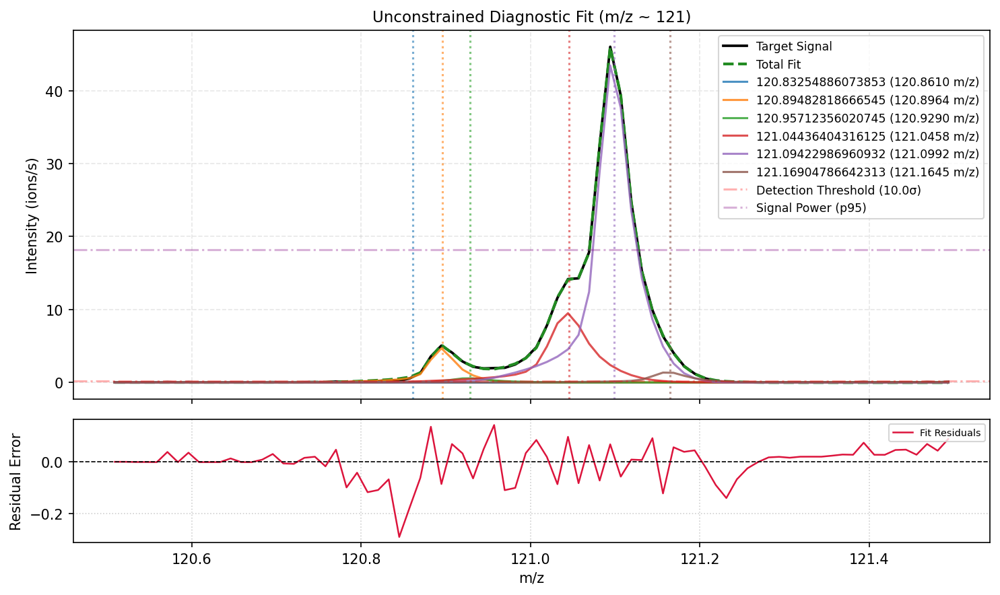

If using all defaults, this method also acts like a multi-overlapping peak fitter as an initial peak discovery step is triggered to populate initial guesses for the unconstrained fitter.

If you would like to specify a certain peak (or peaks) to diagnose during the unconstrained fit you can pass a list of string formulas (or raw float values) via the `initial_masses` parameter:

```python
d.fit_nm_unconstrained(
    nominal_mass=121, 
    initial_masses=["C9H12H+"], # Trimethylbenzene
    peak_type='custom'
)
```

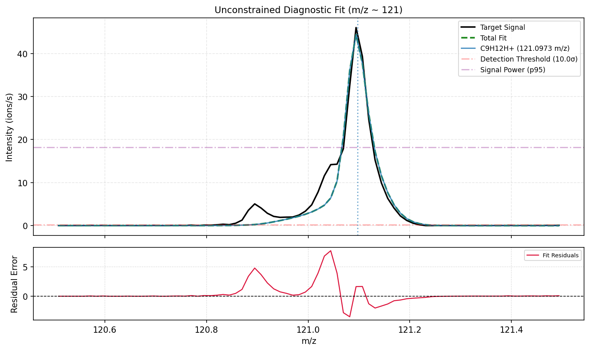

Lets make one more plot showing the functions response with an added unknown mass:

```python
d.fit_nm_unconstrained(
    nominal_mass=121,
    initial_masses=["C9H12H+", 121.02], # Trimethylbenzene, some uknonwn
    peak_type='custom'
)
```

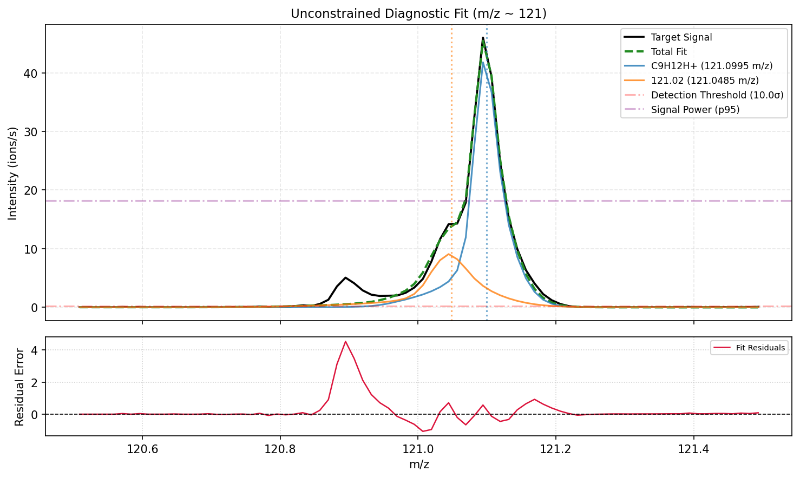

Just like in `fit_nm_constrained` a `ms_i` (mass spectrum index) can be provided to run the fitting procedure over a specific spectra. It will pull from `Deployment.tofdata_subtracted` which is the baseline subtracted version of `Deployment.tofdata`.

The results from running this function can be retrieved through the `Deployment.diagnostic_fits` attribute. This is a nested dictionary whose contents depends on previous calls to both `fit_nm_constrained` and `fit_nm_unconstrained`. For our nominal mass `121` example this dictionary has one entry:

```python
print(d.diagnostic_fits.keys()) # One entry for nominal mass 121
print(d.diagnostic_fits['unconstrained_121'].keys()) # information for some entry
# output
"""
dict_keys(['unconstrained_121'])
dict_keys(['nominal_mass', 'mz_segment', 'int_segment', 'total_fit', 'peaks', 'fit_params'])
"""
```

### Deployment.populate_nm_data_for

This method can be used to access/store the multidimensional array of signal segments corresponding to a particular nominal mass. The results of running this function are stored in `Deployment.nm_data`. This is primarily used to speed up making a timeseries plot of some property affecting the signal/fit.

```python
d.populate_nm_data_for(nominal_mass=121)
```

```python
print(type(d.nm_data))
d.nm_data[121] # dictionary key is integer nominal mass
# output
"""
{'intensity': array([[-0.41106745,  3.71468959, -0.06502896, ...,  0.82661214,
          2.81898013,  2.81898013],
        ...
        [-0.04610766, -0.28749674, -0.53514666, ..., -0.15073785,
         -0.0945124 , -0.0945124 ]], shape=(8194, 81)),
 'neg2d_intensity': array([[ 3.95273780e+00,  2.93520267e+00,  1.73289224e-01, ...,
         -9.52440544e-01, -4.03301208e+00, -4.03301208e+00],
        ...
        [ 3.13042133e-03, -6.55630628e-01, -4.23636553e-01, ...,
          3.25918273e-03, -2.25677288e-01, -2.25677288e-01]],
       shape=(8194, 81)),
 'mass_axes': array([[120.50456396, 120.5170014 , 120.52943948, ..., 121.47661177,
         121.48909928, 121.48909928],
        ...
        [120.51142529, 120.52386331, 120.53630198, ..., 121.48351895,
         121.49600705, 121.49600705]], shape=(8194, 81)),
 'tof_axes': array([[15841.99955196, 15842.99955193, 15843.9995519 , ...,
         15919.99954975, 15920.99954972, 15920.99954972],
        ...
        [15841.99955196, 15842.99955193, 15843.9995519 , ...,
         15919.99954975, 15920.99954972, 15920.99954972]], shape=(8194, 81))}
"""
```

This can be used, for example, to plot what each signal segment at nominal mass 121 looks like throughout the course of standard instrument acquisition. NOTE: notice how becuase the data is aligned in the writebuf/MS index dimension we can use our `Deployment.standard_acquisition_data` attribute directly as a binary mask to filter out periods of "non-standard" data acquisition.

```python
plt.figure(figsize=(12,6))
for i in range(len(d.nm_data[121]['intensity'][d.standard_acquisition_data])):
    plt.plot(d.nm_data[121]['mass_axes'][d.standard_acquisition_data][i, :], 
             d.nm_data[121]['intensity'][d.standard_acquisition_data][i, :], 
             color='black', alpha=0.3)
plt.xlabel("m/z")
plt.ylabel("Intensity (ions/s)")
plt.title("Nominal Mass 121")
plt.grid(True, alpha=0.3, linestyle="--")
plt.show()
```

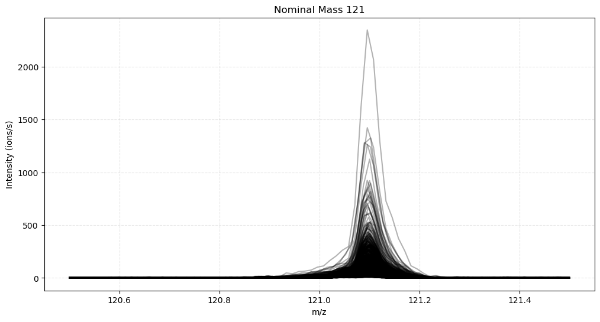

### Deployment.automated_peak_discovery

The `automated_peak_discovery` (sometimes abbreviated as "apd" within the code) function is a method that iteratively calls a Multi-Overlapping Peak Fitting function (sometimes abbreviated as "MOPF" or "mopf" in the code) on each nominal mass window to discover unknown peak locations. By default the reference spectrum is used and the function returns the final fitted peak locations found by the MOPF algorithm. However, if `use_averaged_dataset=True` is specified, the procedure is performed over the entire averaged dataset instead of a single spectrum and the function returns an average peak cluster position, which uses Scikit-learn's DBSCAN (Density-Based Spatial Clustering of Applications with Noise) on a peak positions transformed into FWHM space. 

The function can be called with:

```python
# basic call, just perform fits and return dataframe
d.automated_peak_discovery()

# or if you want to directly overwrite the current peak list with the found unknown peaks
d.automated_peak_discovery(overwrite=True)

# of if you would like a plot of each of the mopf at each nominal mass:
#  plotting increases runtime significantly (from ~5sec to ~3min for sigle Eiger spectra)!
d.automated_peak_discovery(show_plot_flag=False, # dont show each plot
                           save_plot_flag=True, # but do save them!
                           output_dir=None, # default OpenTof location
                           plot_subdir=None,) # use default subdir name

# or if called using the averaged dataset (activates use of DBSCAN on found peak positions):
d.automated_peak_discovery(use_averaged_dataset=True) # Took around 5min for Eiger data
```

Pulling a good example from one of the produced "mopf" plots when `save_plot_flag=True`:

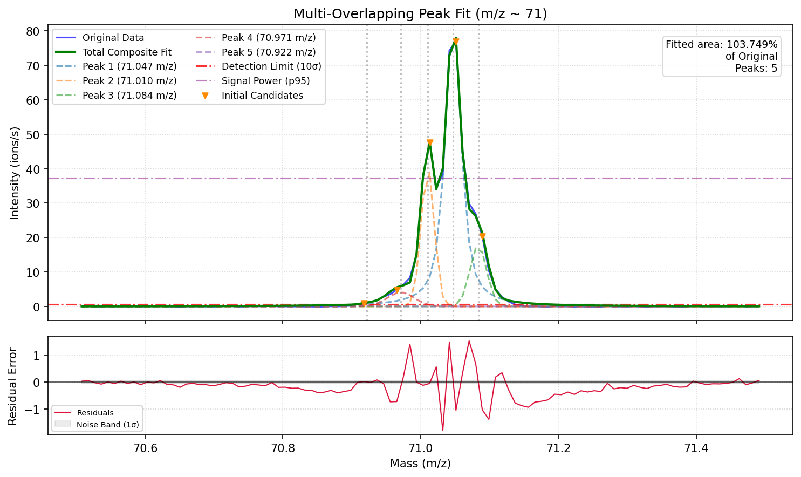

Remember that if both `output_dir` and `plot_subdir` are left as `None` OpenTof will default to a location within the user's home directory. Look for the "OpenTof" directory.

The result of running the function is stored in `Deployment.apd_df`. 

The resulting dataframe has the form:

|     |	spectra_index	    | center_mass |	area       | A          | fwhm_mass |
| --- | ----------------- | ----------- |----------- | ---------- | --------- |
| 0	  | -1	              | 19.020429   |	2694.33901 | 646.093950 | 0.016564  |
| 1	  | -1	              | 18.990941	  | 538.481371 | 119.536414 | 0.020892  |
| 2	  | -1	              | 19.034608	  | 118.884297 | 48.472366	| 0.011388  |
| 3	  | -1	              | 21.025843	  | 6.102654	 | 1.161167   | 0.020288  |
| 4	  | -1	              | 29.999010	  | 63.214414	 | 14.217427	| 0.020341  |
| ... |	...	              | 	...	      | ...	       |...	        | ...       |
| 428	| -1                | 295.090141  |	2.318259	 | 0.261067   | 0.110033  |
| 429	| -1  	            | 355.067364	| 1.355019	 | 0.206158   | 0.105594  |
| 430	| -1	              | 371.103388	| 8.802318	 | 0.940696	  | 0.134097  |
| 431	| -1	              | 372.102944	| 2.766028	 | 0.319721	  | 0.145156  |
| 432	| -1 	              | 373.089544	| 8.353861	 | 0.891106	  | 0.134342  |

if `use_averaged_dataset=True` is specified then the returned data frame will **also** have the columns:

| NM  |	dbscan_labels     | is_high_variance |
| --- | ----------------- | ---------------- | 
| 19	| -1	              | False            |
| 19	| -1	              | False            |
| 19	| -1	              | False            |
| 21	| -1	              | False            |
| 30	| -1	              | False            |
| ... |	...	              | ...              |
| 373	| -1                | False            |
| 374	| -1  	            | False            |
| 375	| -1	              | False            |
| 376	| -1	              | False            |
| 377	| -1 	              | False            | 

IMPORTANT NOTE: it is important to remember that in the case where `use_averaged_dataset=True` the column `dbscan_labels` are labeles specific to each nominal mass, and should not be grouped globally (except for maybe the noise category: `-1`) for the current moment.

To see the discovered peaks across the whole spectrum, we could plot something like:

```python
plt.figure(figsize=(12,6))
plt.plot(d.first_guess_mass_axis, d.reference['reference_spectrum'], color="purple", label="reference spectrum")
plt.vlines(x=d.apd_df['center_mass'].values, ymin=-1, ymax=10000,
           color="grey", linestyle="--", alpha=0.01, label="found unknown masses")
plt.grid(True, alpha=0.3, linestyle=":")
plt.title("Automated Peak Discovery using averaged dataset and DBSCAN clustering")
plt.xlabel("m/z")
plt.ylabel("ions/s")
plt.legend(loc="upper right")
plt.show()
```

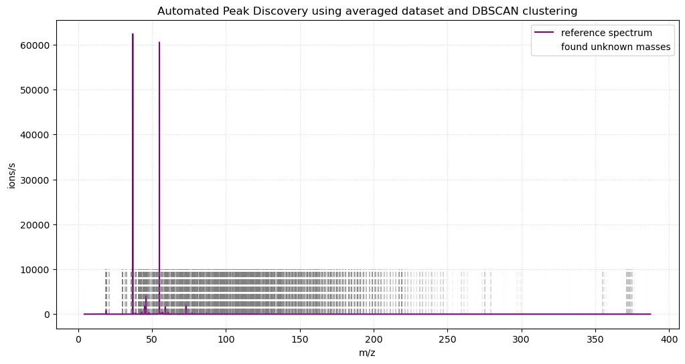

We can also use a function from `utils.py` to help us plot the result at an individual nominal mass:

```python
ot.plot_apd_peaks(
    df=d.apd_df,
    mass_axis=d.first_guess_mass_axis,
    spectrum=d.reference['reference_spectrum'],
    nominal_mass=71,
)
```

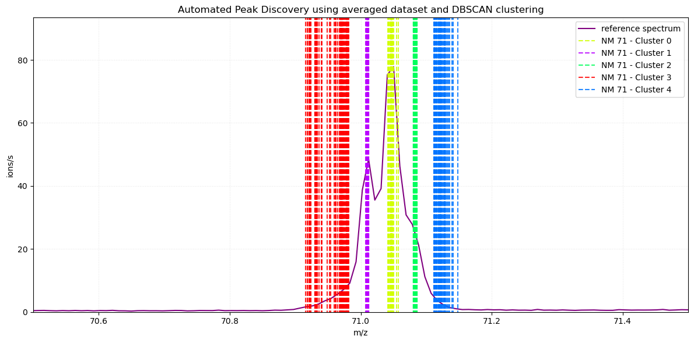

Here we can see the results of this clustering for nominal mass 71. 

If you find yourself calling `automated_peak_discovery` frequently and/or are immediately filtering results down to a specified nominal mass, consider using `fit_mopf_nm (peak_fitting.py)` or `multi_overlap_peak_fit (peak_fitting.py)` to save time!

For more about this method please see the following explainations contained within [utils.md](../user-guide/utils.md)

### Deployment.launch_wizard

Launches the interactive GUI found in `interactive.py`

This is in an experimental state. If you find it useful please consider contributing!

### Deployment.fix_external_calibration and Deployment.auto_fix_external_calibration

Sometimes the external calibration can be off! In which case `d.first_guess_mass_axis` is likely to incorrect and produce non-physical results.

If you notice reagent peaks in the wrong spot on the mass axis this method can be used to reset the mass axis (akin to a manual mass calibration on the instrument itself).

It relies on assuming the composition of the most intense peaks within the mass spectrum. At CDPHE this can sometimes happen with Vocus AIM "B" data. In which case the fix for a broken external calibration can be called via:

```python
iodide_truths = [
                    ot.return_mass("I-"),  # Tallest: I-
                    ot.return_mass("IH2O-"),  # Second tallest: IH2O-
                ] 

d.fix_external_calibration(true_masses=iodide_truths)
# output
"""
Sampling 100 random spectra to isolate anchor peaks...
Searching for the top 2 peak profiles in index space...
  -> Peak 1 localized at Sample Index: 7000.88 (Raw Intensity: 5.45e+05)
  -> Peak 2 localized at Sample Index: 7696.85 (Raw Intensity: 2.36e+05)

Matching sample indices to user expectations:
  Index 7000.88  ===>  True m/z 126.9050
  Index 7696.85  ===>  True m/z 144.9156

Regressing new calibration parameters for Mode 0...
Success! Solved Parameters: [np.float64(900.490409), np.float64(-3143.336327)]
"""
```

It also produces a visualization of the correction:

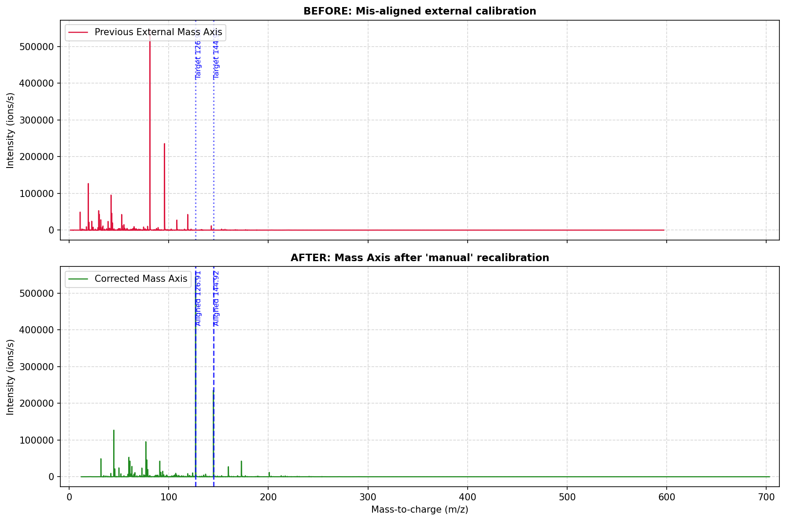

NOTE: Since this method relies on the known peaks being the most and second most intense peaks in the spectrum, if an unknown peak reaches intensities where it can iterfere with this, a `None` can be placed in a certain position within the `truths` array to account for this.

So a `truths` array with `I-` being the most intense peak, some unknown peak being the second most intense peak, and `IH2O-` being the third most intense peak would like:

```python
iodide_truths = [
                    ot.return_mass("I-"),  # Tallest: I-
                    None, # Unknown in second tallest
                    ot.return_mass("IH2O-"),  # Third tallest: IH2O-
                ] 
```

A helper function to iteratively try combinations of the peaks within the `truths` array is also available within OpenTof as `auto_fix_external_calibration`.

The difference between `fix_external_calibration` and `auto_fix_external_calibration` is that in `auto_fix_external_calibration` only the known `truths` should be used (no `None` peaks) as `None` (unknown) peaks will be automatically injected between the unknown peaks. 

The `auto_fix_external_calibration` also bases its "corrected" mass axis based on a provided `target_max` this should be populated with the typical highest mass to charge observed when the instrument is operating under normal conditions.

### Deployment.nominal_mass_som (Experimental!)

This function has yet to be updated to match changes to core methods

### Deployment.export_to_h5

This is the primary function used to save an OpenTof deployment object (since it cannot be pickled directly due to underlying .h5 file structure).

To export a Deployment object first determine where the files are to be saved (can be/often is the same as the RAW data) then call:

```python
d.export_to_h5(output_dir=r"C:\Users\vageiser\Desktop\test", driver="PIF")
```

There are a few different `driver`s available currently.

To save Tofware formatted `"IF"` and `"_P"` files use `driver="PIF"`.
To save the Deployemnt object for use later by OpenTof again use `driver="OT"`

### Deployment.import_from_h5

By default when initializing a `Deployment` object with `from_directory` OpenTof will automatically look for `"IF"` and `"Processed"` files present in subdirectories where the raw data is stored (typically how Tofware saves files). However, to explicitly read these files into a `Deployment` object this method can be used. However, this method must be used when importting previously saved `Deployments` using the `"OT"` driver.

```python
# # Earlier...
# d.export_to_h5(output_dir=r"C:\Users\vageiser\Desktop\test", driver="OT")

# Now
dd = ot.Deployment() # Can be empty for driver="OT
dd.import_from_h5(r"C:\Users\vageiser\Desktop\test\opentof_deployment.h5", driver="OT")

print(dd.tofdata)
# output 
"""
dask.array<array, shape=(8194, 31104), dtype=float32, chunksize=(1000, 31104), chunktype=numpy.ndarray>
"""
```

If exporting using `driver="PIF"` to the same directory as the raw data `import_from_h5` can be skipped as OpenTof will automatically read in these directories via `from_deployment`. However, if `"IF"` and `"Proccesed"` files are saved elsewhere, then this method should still be used like so:

```python
dd = ot.Deployment.from_directory(r"C:\path\to\data\20260508") 
dd.import_from_h5(r"C:\path\to\data\somewhere_else", driver="PIF")
```

### Deployment.export_peak_list_to_Tofware

This is a helper function that will export the currently active `Deployment.peak_list` and format it so it can be read into Tofware.

```python
dd.export_peak_list_to_tofware() # uses default save location
# output
"""
✅ Tofware peak list exported successfully (1113 peaks) to:
  -> C:\Users\vageiser\OpenTof\20260508_145024\tofware_peak_list.txt
"""
```

### HDF5ArrayWrapper

This is the only code within `deployment.py` that is not part of `class Deployment`. This code acts as the intermediary between raw .h5 files and many of the functions within OpenTof. 

Its purpose is to help with out-of-core/larger than memory datasets while still being able to seriealze during parallel execution (during `FFI` routines).